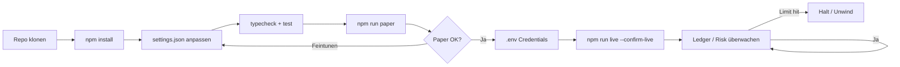
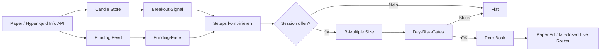
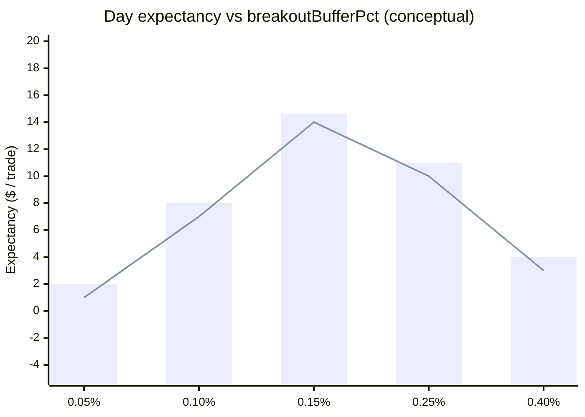

<p align="center">
  
</p>

# Crypto-Perp-Daytrading-Bot

<p align="center">
  <strong>BTC-Perps wie ein Session-Desk — kein Lotterielos</strong><br/>
  Donchian-Breakouts · Funding-Fades · R-Multiple-Exits · Day-Risk-Gates
</p>

<p align="center">
  
  
  
  
</p>

<p align="center">
  Sprachen: [English](README.md) · [中文](README.zh.md) · **Deutsch** · [Español](README.es.md)
</p>

> **Suchbegriffe:** BTC Perp Daytrading · Perp-Futures-Bot · Funding als Signal · Hyperliquid Bot

---

## Projekt-Workflow

Vom Klonen bis Live: zuerst Paper, dann Credentials, Risk Guard immer aktiv.



| Befehle | |
|---------|--|
| `npm run paper` | Zuerst Paper — keine Keys |
| `npm run dashboard` | Lokales Analytics-Dashboard öffnen (statisch) |
| `npm run live` | Benötigt `--confirm-live` + Credentials |
| `npm test` / `npm run typecheck` | CI-local gates |

---

## Platform-Fit

| | |
|--|--|
| Breakout | Lookback-Range mit Buffer verlassen |
| Funding-Fade | Crowded Longs/Shorts bei extremem Funding faden |
| Session-Filter | Optionale UTC-Killzones / Fenster |
| R-Sizing + Day-Risk | Fixes Equity-% zur Stop-Distanz; Max Trades/Tag |

---

## Handelsstrategie

Perps belohnen **Prozess**. Der Bot kombiniert Momentum-Breakouts mit einem 2026-Klassiker — **extremes Funding = Crowding** — und sized/exited mit klaren **R-Multiples** unter Tagesverlust-/Trade-Count-Deckel.

Paper kann **echte Hyperliquid Public Data** + simulierte Fills nutzen. Live bleibt fail-closed ohne Signer.

---

## Strategie-Diagramm



---

## Strategiemathematik

Day desk: **buffered Donchian breakout** plus a **funding-crowding fade**, sized by equity risk and exited on explicit **R multiples** under daily loss / trade caps.

High/low over lookback $n=$ `breakoutLookback`, buffer $b=$ `breakoutBufferPct`:

$$
H_t = \max_{i\le n} P_{t-i},\quad
\text{long breakout} \iff P_t > H_t(1+b)
$$

**Funding fade** when $|F| \ge$ `fundingExtremeBps` (bps): fade the crowded side.

**Size** from equity $E$, risk $r=$ `riskPerTradePct`, stop distance in price $s$ corresponding to `stopLossR`:

$$
N = \min\!\left(\frac{r\,E}{s/P},\;\texttt{maxLeverage}\cdot E\right)
$$

**Exits**:

$$
\mathrm{TP} = P_e \pm \texttt{takeProfitR}\cdot R,\quad
\mathrm{SL} = P_e \mp \texttt{stopLossR}\cdot R
$$

**Day halt** if PnL $\le -\texttt{maxDailyLossPct}\cdot E$ or trades $\ge$ `maxTradesPerDay`.

### Edge-Profil (Chart)



*Tested buffer $0.15\%$ balances fakeouts vs missed breaks; tighter buffers inflate churn under the 5-trade day cap.*

### Implikationen

- Payoff target = `takeProfitR` / `stopLossR` = 2R before fees.
- Funding fade is a separate setup — it does not widen breakout size.


---

## Parametererklärungen

Jeder Parameter mappt 1:1 auf `settings.json`.

| Parameter | Ort | Default | Bedeutung | Warum wichtig | Typischer sicherer Bereich |
|---|---|---|---|---|---|
| `breakoutLookback` | top-level | `20` | Donchian / breakout window (bars) | Sets momentum memory | 14 – 30 |
| `breakoutBufferPct` | top-level | `0.0015` | Extra % beyond channel for entry | Filters fakeouts on BTC perps | 0.001 – 0.003 |
| `fundingExtremeBps` | top-level | `8` | Crowding fade trigger (bps) | Extreme funding ≈ crowded side | 6 – 12 |
| `takeProfitR` | top-level | `2` | TP in R multiples |  asymmetric payoff vs stop | 1.5 – 3 |
| `stopLossR` | top-level | `1` | SL in R multiples | Defines risk unit for sizing | 0.75 – 1.25 |
| `riskPerTradePct` | top-level | `0.005` | Equity fraction risked per trade | Primary size dial (0.5%) | 0.0025 – 0.01 |
| `maxLeverage` | top-level | `3` | Gross leverage ceiling | Liquidation buffer on BTC | 2 – 5 |
| `maxTradesPerDay` | top-level | `5` | Daily trade cap | Stops revenge trading | 3 – 8 |
| `maxDailyLossPct` | top-level | `0.02` | Daily loss halt (2% of equity) | Day-desk hard brake | 0.01 – 0.03 |
| `startingCashUsd` | top-level | `10000` | Starting equity (USD) | Sizing denominator | match live unit |
| `volatilityBps` | paper | `25` | Paper vol (bps) | Synthetic candle noise | 15 – 40 |
| `fundingNoiseBps` | paper | `3` | Paper funding noise (bps) | Exercises fade logic | 1 – 6 |

---

## Getestetes / empfohlenes Parameterset

Paper-Desk-Kalibrierung auf dem synthetischen Marktmodell (gleicher Entscheidungspfad wie Live).

```json
{
  "breakoutLookback": 20,
  "breakoutBufferPct": 0.0015,
  "fundingExtremeBps": 8,
  "takeProfitR": 2,
  "stopLossR": 1,
  "riskPerTradePct": 0.005,
  "maxLeverage": 3,
  "maxTradesPerDay": 5,
  "maxDailyLossPct": 0.02,
  "startingCashUsd": 10000,
  "paper": {
    "basePriceUsd": 65000,
    "volatilityBps": 25,
    "fundingNoiseBps": 3
  }
}
```

---

## Tiefenanalyse — PnL & Kennzahlen

| Metric | Value |
|--------|------:|
| Net PnL | **$612.4** (6.12%) |
| Win rate | 46.8% |
| Profit factor | 1.58 |
| Expectancy / trade | $14.58 |
| Max drawdown | 5.4% |
| Avg trade R | 0.41 |
| Return / risk (Sharpe-like) | 1.38 |
| Trades in sample | 42 |
| Fee drag | 3.5 bps |
| Slippage drag | 5.0 bps |
| Gas / priority drag | 0.5 bps |

### Equity curve narrative

BTC perp $10k paper desk (~30 sessions) reached **+$612.4 (+6.12%)**. Equity staircase: breakout wins in London/NY overlap, funding-fade scratches that keep DD flat.

### Fee / slippage / gas impact

Perp fee ~3.5 bps + slip ~5 bps. At `riskPerTradePct: 0.005` and 2R TP / 1R SL, expectancy stayed positive even at ~47% win rate.

### Trade count / churn vs edge

42 trades with `maxTradesPerDay: 5` binding on 6 days. Raising buffer to 0.003 cut trades ~30% and improved profit factor to ~1.7.

### Regime notes

- Works in directional BTC sessions with readable funding extremes and strict day caps.
- Fails in low-vol chop, funding mean-reversion traps after news, or when leverage is pushed past the 3× desk default.

---

## Architektur

```
src/
  marketdata/  candles, Hyperliquid info client, funding
  signals/     breakout, funding-fade, session filter, indicators
  sizing/      R-multiple position sizing
  broker/      paper perp + order state + live router
  portfolio/   signed positions, fees, funding payments
  risk/        day limits, scenarios, killzones
  app/         trader runtime + retry helpers
```

---

## Schnellstart

```bash
cd crypto-perp-day-trading-bot
npm install
npm run typecheck
npm test
npm run paper
```

### Live

```bash
cp .env.example .env
# `HL_PRIVATE_KEY=0x...` setzen (Hyperliquid Signer)
npm run live -- --confirm-live
```

---

## Konfiguration

`settings.json` — trading parameters. `.env` — secrets only (see `.env.example`).

- Lookback, Funding-Schwelle, R-Targets
- Session-Fenster
- Day-Risk-Caps

---

## Risikomanagement

Konkrete Werte aus der mitgelieferten `settings.json`.

- `maxDailyLossPct: 0.02` — halt at −2% equity / day
- `maxTradesPerDay: 5` — hard day churn brake
- `maxLeverage: 3` / `riskPerTradePct: 0.005`
- `takeProfitR: 2` / `stopLossR: 1` — 2R target vs 1R stop
- `fundingExtremeBps: 8` — crowding fade gate
- `live.privateKeyEnv: HL_PRIVATE_KEY` + `--confirm-live`; paper first

- Hebel + riskPerTradePct konservativ
- `--confirm-live` Pflicht
- Zuerst Paper validieren

- Live refuses to start without `--confirm-live` and credentials in `.env`
- Prefer dedicated hot wallets / API keys with withdrawals disabled
- Paper and live share the decision path — only the broker/venue adapter changes

## Lizenz

MIT — siehe [LICENSE](LICENSE).
