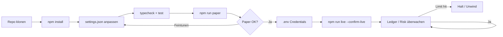
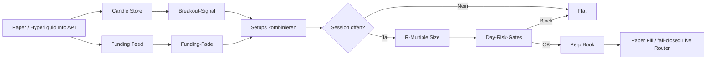

<p align="center">
  
</p>

# Crypto-Perp-Daytrading-Bot

<p align="center">
  <strong>BTC-Perps wie ein Session-Desk — kein Lotterielos</strong><br/>
  Donchian-Breakouts · Funding-Fades · R-Multiple-Exits · Day-Risk-Gates
</p>

<p align="center">
  
  
  
  
</p>

<p align="center">
  Sprachen: [English](README.md) · [中文](README.zh.md) · **Deutsch** · [Español](README.es.md)
</p>

> **Suchbegriffe:** BTC Perp Daytrading · Perp-Futures-Bot · Funding als Signal · Hyperliquid Bot

Perps belohnen **Prozess**. Der Bot kombiniert Momentum-Breakouts mit einem 2026-Klassiker — **extremes Funding = Crowding** — und sized/exited mit klaren **R-Multiples** unter Tagesverlust-/Trade-Count-Deckel.

---

## Projekt-Workflow

Vom Klonen bis Live: zuerst Paper, dann Credentials, Risk Guard immer aktiv.



| Befehle | |
|---------|--|
| `npm run paper` | Zuerst Paper-Modus |
| `npm run live` | Benötigt `--confirm-live` + Credentials |
| `npm test` / `npm run typecheck` | CI-local gates |

---

## Edge-Toolkit

| | |
|--|--|
| Breakout | Lookback-Range mit Buffer verlassen |
| Funding-Fade | Crowded Longs/Shorts bei extremem Funding faden |
| Session-Filter | Optionale UTC-Killzones / Fenster |
| R-Sizing + Day-Risk | Fixes Equity-% zur Stop-Distanz; Max Trades/Tag |

---

## Strategie-Diagramm



Paper kann **echte Hyperliquid Public Data** + simulierte Fills nutzen. Live bleibt fail-closed ohne Signer.

---

## Architektur

```
src/
  marketdata/  candles, Hyperliquid info client, funding
  signals/     breakout, funding-fade, session filter, indicators
  sizing/      R-multiple position sizing
  broker/      paper perp + order state + live router
  portfolio/   signed positions, fees, funding payments
  risk/        day limits, scenarios, killzones
  app/         trader runtime + retry helpers
```

---

## Schnellstart

```bash
cd crypto-perp-day-trading-bot
npm install
npm run typecheck
npm test
npm run paper
```

### Live

```bash
cp .env.example .env
# `HL_PRIVATE_KEY=0x...` setzen (Hyperliquid Signer)
npm run live
```

---

## Konfiguration

`settings.json` — trading parameters. `.env` — secrets only (see `.env.example`).

- Lookback, Funding-Schwelle, R-Targets
- Session-Fenster
- Day-Risk-Caps

---

## Risiko & Sicherheit

- Hebel + riskPerTradePct konservativ
- `--confirm-live` Pflicht
- Zuerst Paper validieren

---

## Haftungsausschluss

Gehebelte Perps können Konten schnell liquidieren. MIT-Software zu Bildungs-/Forschungszwecken — **keine Finanzberatung**. Größe, Börsenregeln und Compliance liegen bei Ihnen.

## Lizenz

MIT — siehe [LICENSE](LICENSE).
