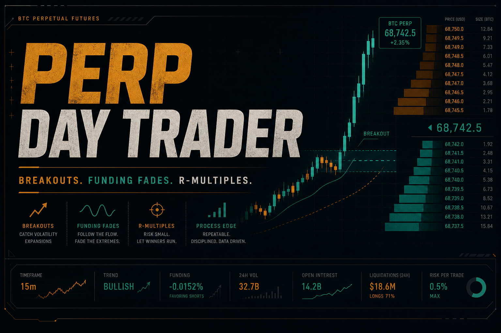
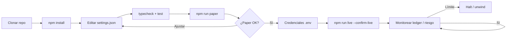
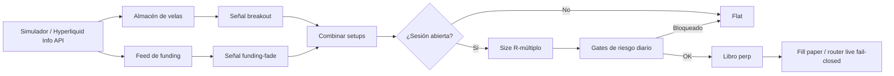

<p align="center">
  
</p>

# Bot de Day Trading de Perps Crypto

<p align="center">
  <strong>Opera BTC perps como un desk de sesión — no como lotería</strong><br/>
  Breakouts estilo Donchian · Fades de funding · Salidas R-múltiplo · Gates de riesgo diario
</p>

<p align="center">
  
  
  
  
</p>

<p align="center">
  Idiomas: [English](README.md) · [中文](README.zh.md) · [Deutsch](README.de.md) · **Español**
</p>

> **Palabras clave:** day trading BTC perp · bot de futuros perpetuos · funding como señal · bot Hyperliquid

Los perps premian el **proceso**. Este bot combina breakouts de momentum con una señal clásica de 2026 — **funding extremo = crowding** — y sizea/sale con **R-múltiplos** bajo techo de pérdida diaria / nº de trades.

---

## Flujo del proyecto

Camino completo de clon a live: primero paper, luego credenciales, riesgo siempre activo.



| Comandos | |
|---------|--|
| `npm run paper` | Primero modo paper |
| `npm run live` | Requiere `--confirm-live` + credenciales |
| `npm test` / `npm run typecheck` | CI-local gates |

---

## Kit de edge

| | |
|--|--|
| Breakout | Salir del rango lookback con buffer |
| Funding fade | Fadear longs/shorts saturados con funding extremo |
| Filtro de sesión | Killzones UTC / ventanas opcionales |
| R sizing + riesgo diario | % fijo de equity a distancia de stop; máx trades/día |

---

## Diagrama de estrategia



Paper puede usar **datos públicos reales de Hyperliquid** con fills simulados. Live permanece fail-closed sin signer.

---

## Arquitectura

```
src/
  marketdata/  candles, Hyperliquid info client, funding
  signals/     breakout, funding-fade, session filter, indicators
  sizing/      R-multiple position sizing
  broker/      paper perp + order state + live router
  portfolio/   signed positions, fees, funding payments
  risk/        day limits, scenarios, killzones
  app/         trader runtime + retry helpers
```

---

## Inicio rápido

```bash
cd crypto-perp-day-trading-bot
npm install
npm run typecheck
npm test
npm run paper
```

### Live

```bash
cp .env.example .env
# configura `HL_PRIVATE_KEY=0x...` (signer de cuenta Hyperliquid)
npm run live
```

---

## Configuración

`settings.json` — trading parameters. `.env` — secrets only (see `.env.example`).

- Lookback, umbral funding, objetivos R
- Ventanas de sesión
- Caps de riesgo diario

---

## Riesgo y seguridad

- Mantén apalancamiento + riskPerTradePct conservadores
- `--confirm-live` obligatorio
- Valida primero en paper

---

## Aviso legal

Los perps apalancados pueden liquidar cuentas rápido. Software educativo MIT — **no es asesoramiento financiero**. Usted responde por el tamaño, reglas del venue y cumplimiento.

## Licencia

MIT — ver [LICENSE](LICENSE).
