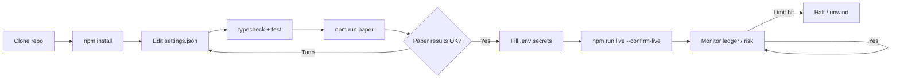
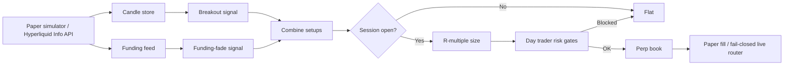

<p align="center">
  
</p>

# Crypto Perp Day Trading Bot

<p align="center">
  <strong>Trade BTC perps like a session desk — not a lottery ticket</strong><br/>
  Donchian-style breakouts · Crowded-funding fades · R-multiple exits · Day-risk gates
</p>

<p align="center">
  
  
  
  
</p>

<p align="center">
  Languages: **English** · [中文](README.zh.md) · [Deutsch](README.de.md) · [Español](README.es.md)
</p>

> **Search keywords:** BTC perp day trading · crypto perpetual futures bot · funding rate as signal · Hyperliquid trading bot

Perps reward **process**. This bot combines momentum breakouts with a classic 2026 tell — **extreme funding as crowding** — then sizes and exits with explicit **R multiples** under a daily loss / trade-count ceiling.

---

## Performance snapshot

Demo analytics from the included static dashboard (`npm run dashboard`). Banners and strategy diagrams stay above/below.

<p align="center">
  
</p>

<p align="center">
  
</p>

<p align="center">
  
</p>

---

## Project workflow

End-to-end path from clone to live — paper first, credentials last, risk always on.



| Commands | |
|---------|--|
| `npm run paper` | Paper first |
| `npm run dashboard` | Open local analytics dashboard (static) |
| `npm run live` | Requires `--confirm-live` + credentials |
| `npm test` / `npm run typecheck` | CI-local gates |

---

## Edge toolkit

| | |
|--|--|
| Breakout | Leave the lookback range with a buffer |
| Funding fade | Fade crowded longs/shorts when funding is extreme |
| Session filter | Optional UTC killzones / trading windows |
| R sizing + day risk | Fixed equity % to stop distance; max trades/day |

---

## Strategy diagram



Paper can use **real Hyperliquid public data** with simulated fills. Live stays fail-closed without a signer.

---

## Architecture

```
src/
  marketdata/  candles, Hyperliquid info client, funding
  signals/     breakout, funding-fade, session filter, indicators
  sizing/      R-multiple position sizing
  broker/      paper perp + order state + live router
  portfolio/   signed positions, fees, funding payments
  risk/        day limits, scenarios, killzones
  app/         trader runtime + retry helpers
```

---

## Quickstart

```bash
cd crypto-perp-day-trading-bot
npm install
npm run typecheck
npm test
npm run paper
```

### Live

```bash
cp .env.example .env
# set `HL_PRIVATE_KEY=0x...` (Hyperliquid account signer)
npm run live
```

---

## Configuration

`settings.json` — trading parameters. `.env` — secrets only (see `.env.example`).

- Lookback, funding threshold, R targets
- Session windows
- Day risk caps

---

## Risk & safety

- Keep leverage + riskPerTradePct conservative
- `--confirm-live` required
- Validate on paper first

---

## Disclaimer

Leveraged perps can liquidate accounts quickly. Educational MIT software — **not financial advice**. You are responsible for sizing, venue rules, and compliance.

## License

MIT — see [LICENSE](LICENSE).
