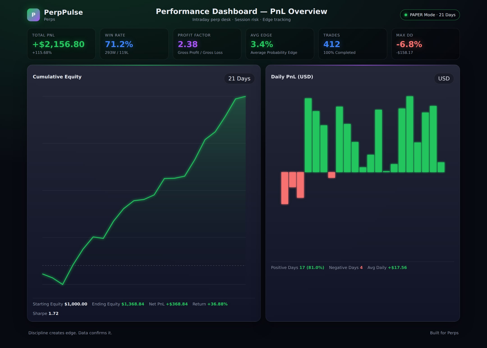
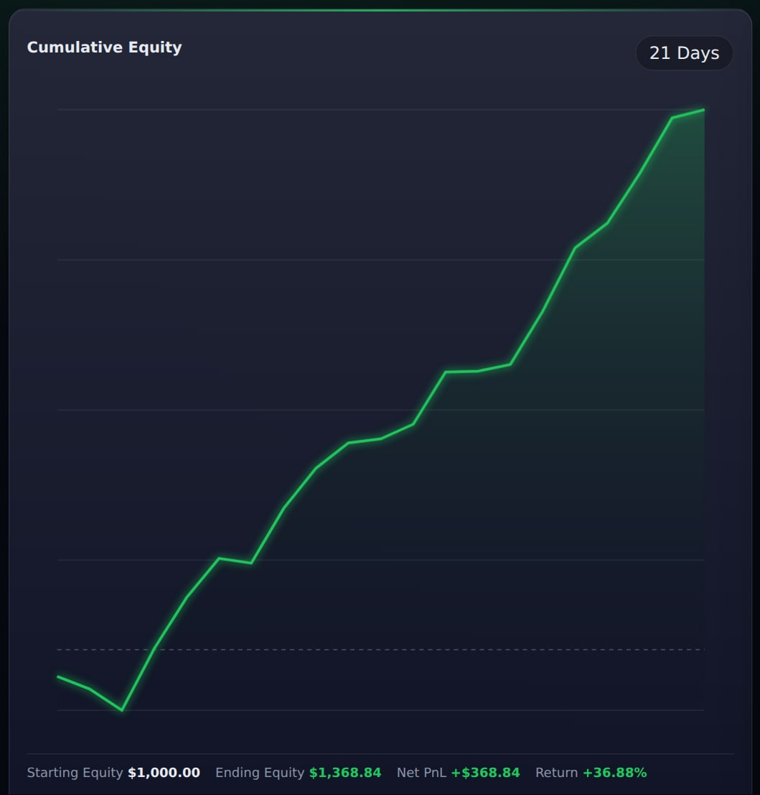
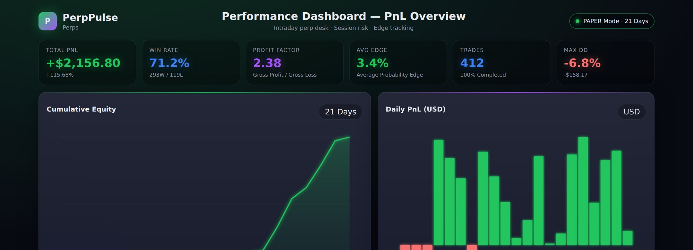
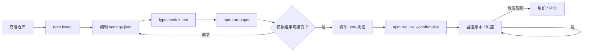
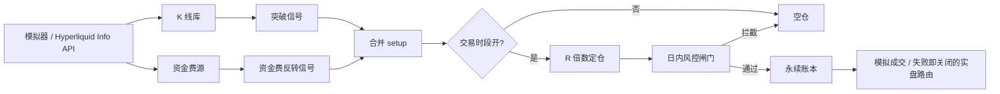

<p align="center">
  
</p>

# 加密永续日内交易机器人

<p align="center">
  <strong>像交易台一样做 BTC 永续 — 而不是买彩票</strong><br/>
  类 Donchian 突破 · 拥挤资金费反转 · R 倍数出场 · 日内风控闸门
</p>

<p align="center">
  
  
  
  
</p>

<p align="center">
  语言: [English](README.md) · **中文** · [Deutsch](README.de.md) · [Español](README.es.md)
</p>

> **搜索关键词:** BTC 永续日内 · 永续合约机器人 · 资金费信号 · Hyperliquid 交易机器人

永续奖励**流程纪律**。本机器人结合动量突破与 2026 经典信号 — **极端资金费=拥挤** — 并以明确的 **R 倍数** 定仓与出场，同时受日亏损/交易次数上限约束。

---

## 表现快照

内置静态仪表盘演示数据（`npm run dashboard`）。横幅与策略流程图保持不变。

<p align="center">
  
</p>

<p align="center">
  
</p>

<p align="center">
  
</p>

---

## 项目工作流

从克隆到实盘的完整路径：先模拟盘，后凭证，风控始终开启。



| 命令 | |
|---------|--|
| `npm run paper` | 先跑模拟盘 |
| `npm run dashboard` | 打开本地分析仪表盘（静态） |
| `npm run live` | 需要 `--confirm-live` 与有效凭证 |
| `npm test` / `npm run typecheck` | CI-local gates |

---

## 优势工具箱

| | |
|--|--|
| 突破 | 带缓冲突破回看区间 |
| 资金费反转 | 资金费极端时反向拥挤多/空 |
| 交易时段过滤 | 可选 UTC 禁区 / 交易窗口 |
| R 定仓 + 日内风控 | 按止损距离风险固定权益%；每日最大交易数 |

---

## 策略流程图



模拟盘可用 **Hyperliquid 真实公开数据** + 模拟成交。无签名器时实盘失败即关闭。

---

## 架构

```
src/
  marketdata/  candles, Hyperliquid info client, funding
  signals/     breakout, funding-fade, session filter, indicators
  sizing/      R-multiple position sizing
  broker/      paper perp + order state + live router
  portfolio/   signed positions, fees, funding payments
  risk/        day limits, scenarios, killzones
  app/         trader runtime + retry helpers
```

---

## 快速开始

```bash
cd crypto-perp-day-trading-bot
npm install
npm run typecheck
npm test
npm run paper
```

### 实盘

```bash
cp .env.example .env
# 设置 `HL_PRIVATE_KEY=0x...`（Hyperliquid 账户签名器）
npm run live
```

---

## 配置

`settings.json` — trading parameters. `.env` — secrets only (see `.env.example`).

- 回看、资金费阈值、R 目标
- 交易时段窗口
- 日内风控上限

---

## 风险与安全

- 杠杆与 riskPerTradePct 保持保守
- 必须 `--confirm-live`
- 先验证模拟盘

---

## 免责声明

带杠杆的永续可能迅速爆仓。 本仓库为 MIT 教育/研究软件 — **不构成投资建议**。仓位、交易所规则与合规责任由您自行承担。

## 许可证

MIT — 见 [LICENSE](LICENSE)。
