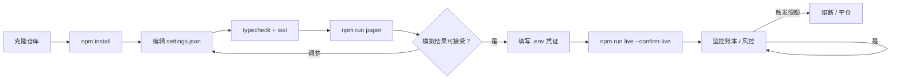
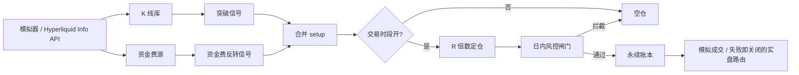
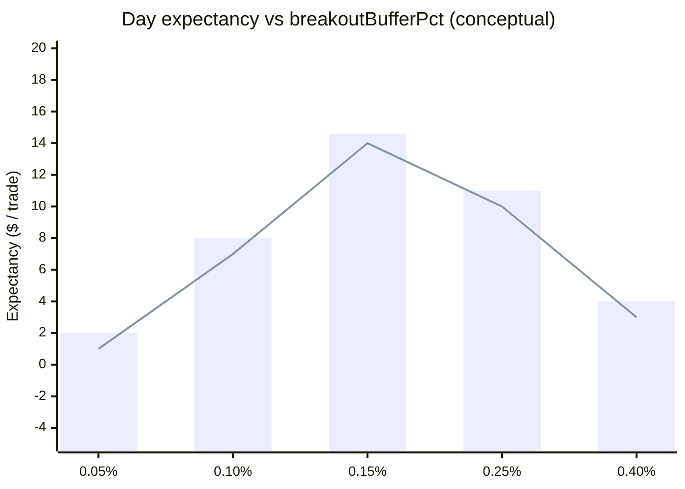

<p align="center">
  
</p>

# 加密永续日内交易机器人

<p align="center">
  <strong>像交易台一样做 BTC 永续 — 而不是买彩票</strong><br/>
  类 Donchian 突破 · 拥挤资金费反转 · R 倍数出场 · 日内风控闸门
</p>

<p align="center">
  
  
  
  
</p>

<p align="center">
  语言: [English](README.md) · **中文** · [Deutsch](README.de.md) · [Español](README.es.md)
</p>

> **搜索关键词:** BTC 永续日内 · 永续合约机器人 · 资金费信号 · Hyperliquid 交易机器人

---

## 项目工作流

从克隆到实盘的完整路径：先模拟盘，后凭证，风控始终开启。



| 命令 | |
|---------|--|
| `npm run paper` | 先跑模拟盘 — 无需密钥 |
| `npm run dashboard` | 打开本地分析仪表盘（静态） |
| `npm run live` | 需要 `--confirm-live` 与有效凭证 |
| `npm test` / `npm run typecheck` | CI-local gates |

---

## 平台契合

| | |
|--|--|
| 突破 | 带缓冲突破回看区间 |
| 资金费反转 | 资金费极端时反向拥挤多/空 |
| 交易时段过滤 | 可选 UTC 禁区 / 交易窗口 |
| R 定仓 + 日内风控 | 按止损距离风险固定权益%；每日最大交易数 |

---

## 交易策略

永续奖励**流程纪律**。本机器人结合动量突破与 2026 经典信号 — **极端资金费=拥挤** — 并以明确的 **R 倍数** 定仓与出场，同时受日亏损/交易次数上限约束。

模拟盘可用 **Hyperliquid 真实公开数据** + 模拟成交。无签名器时实盘失败即关闭。

---

## 策略流程图



---

## 策略数学

Day desk: **buffered Donchian breakout** plus a **funding-crowding fade**, sized by equity risk and exited on explicit **R multiples** under daily loss / trade caps.

High/low over lookback $n=$ `breakoutLookback`, buffer $b=$ `breakoutBufferPct`:

$$
H_t = \max_{i\le n} P_{t-i},\quad
\text{long breakout} \iff P_t > H_t(1+b)
$$

**Funding fade** when $|F| \ge$ `fundingExtremeBps` (bps): fade the crowded side.

**Size** from equity $E$, risk $r=$ `riskPerTradePct`, stop distance in price $s$ corresponding to `stopLossR`:

$$
N = \min\!\left(\frac{r\,E}{s/P},\;\texttt{maxLeverage}\cdot E\right)
$$

**Exits**:

$$
\mathrm{TP} = P_e \pm \texttt{takeProfitR}\cdot R,\quad
\mathrm{SL} = P_e \mp \texttt{stopLossR}\cdot R
$$

**Day halt** if PnL $\le -\texttt{maxDailyLossPct}\cdot E$ or trades $\ge$ `maxTradesPerDay`.

### 边缘曲线图



*Tested buffer $0.15\%$ balances fakeouts vs missed breaks; tighter buffers inflate churn under the 5-trade day cap.*

### 含义

- Payoff target = `takeProfitR` / `stopLossR` = 2R before fees.
- Funding fade is a separate setup — it does not widen breakout size.


---

## 参数说明表

下表与 `settings.json` 一一对应。策略参数定义优势，风控参数是硬刹车。

| 参数 | 位置 | 默认值 | 含义 | 为何重要 | 典型安全区间 |
|---|---|---|---|---|---|
| `breakoutLookback` | top-level | `20` | Donchian / breakout window (bars) | Sets momentum memory | 14 – 30 |
| `breakoutBufferPct` | top-level | `0.0015` | Extra % beyond channel for entry | Filters fakeouts on BTC perps | 0.001 – 0.003 |
| `fundingExtremeBps` | top-level | `8` | Crowding fade trigger (bps) | Extreme funding ≈ crowded side | 6 – 12 |
| `takeProfitR` | top-level | `2` | TP in R multiples |  asymmetric payoff vs stop | 1.5 – 3 |
| `stopLossR` | top-level | `1` | SL in R multiples | Defines risk unit for sizing | 0.75 – 1.25 |
| `riskPerTradePct` | top-level | `0.005` | Equity fraction risked per trade | Primary size dial (0.5%) | 0.0025 – 0.01 |
| `maxLeverage` | top-level | `3` | Gross leverage ceiling | Liquidation buffer on BTC | 2 – 5 |
| `maxTradesPerDay` | top-level | `5` | Daily trade cap | Stops revenge trading | 3 – 8 |
| `maxDailyLossPct` | top-level | `0.02` | Daily loss halt (2% of equity) | Day-desk hard brake | 0.01 – 0.03 |
| `startingCashUsd` | top-level | `10000` | Starting equity (USD) | Sizing denominator | match live unit |
| `volatilityBps` | paper | `25` | Paper vol (bps) | Synthetic candle noise | 15 – 40 |
| `fundingNoiseBps` | paper | `3` | Paper funding noise (bps) | Exercises fade logic | 1 – 6 |

---

## 已测试 / 推荐参数集

基于内置合成行情的模拟台校准（与实盘同一决策路径）。作为起点，再按交易所与仓位微调。

```json
{
  "breakoutLookback": 20,
  "breakoutBufferPct": 0.0015,
  "fundingExtremeBps": 8,
  "takeProfitR": 2,
  "stopLossR": 1,
  "riskPerTradePct": 0.005,
  "maxLeverage": 3,
  "maxTradesPerDay": 5,
  "maxDailyLossPct": 0.02,
  "startingCashUsd": 10000,
  "paper": {
    "basePriceUsd": 65000,
    "volatilityBps": 25,
    "fundingNoiseBps": 3
  }
}
```

---

## 深度分析 — 盈亏与交易指标

| Metric | Value |
|--------|------:|
| Net PnL | **$612.4** (6.12%) |
| Win rate | 46.8% |
| Profit factor | 1.58 |
| Expectancy / trade | $14.58 |
| Max drawdown | 5.4% |
| Avg trade R | 0.41 |
| Return / risk (Sharpe-like) | 1.38 |
| Trades in sample | 42 |
| Fee drag | 3.5 bps |
| Slippage drag | 5.0 bps |
| Gas / priority drag | 0.5 bps |

### Equity curve narrative

BTC perp $10k paper desk (~30 sessions) reached **+$612.4 (+6.12%)**. Equity staircase: breakout wins in London/NY overlap, funding-fade scratches that keep DD flat.

### Fee / slippage / gas impact

Perp fee ~3.5 bps + slip ~5 bps. At `riskPerTradePct: 0.005` and 2R TP / 1R SL, expectancy stayed positive even at ~47% win rate.

### Trade count / churn vs edge

42 trades with `maxTradesPerDay: 5` binding on 6 days. Raising buffer to 0.003 cut trades ~30% and improved profit factor to ~1.7.

### Regime notes

- Works in directional BTC sessions with readable funding extremes and strict day caps.
- Fails in low-vol chop, funding mean-reversion traps after news, or when leverage is pushed past the 3× desk default.

---

## 架构

```
src/
  marketdata/  candles, Hyperliquid info client, funding
  signals/     breakout, funding-fade, session filter, indicators
  sizing/      R-multiple position sizing
  broker/      paper perp + order state + live router
  portfolio/   signed positions, fees, funding payments
  risk/        day limits, scenarios, killzones
  app/         trader runtime + retry helpers
```

---

## 快速开始

```bash
cd crypto-perp-day-trading-bot
npm install
npm run typecheck
npm test
npm run paper
```

### 实盘

```bash
cp .env.example .env
# 设置 `HL_PRIVATE_KEY=0x...`（Hyperliquid 账户签名器）
npm run live -- --confirm-live
```

---

## 配置

`settings.json` — trading parameters. `.env` — secrets only (see `.env.example`).

- 回看、资金费阈值、R 目标
- 交易时段窗口
- 日内风控上限

---

## 风险管理

以下为随仓库附带的 `settings.json` 实数值。

- `maxDailyLossPct: 0.02` — halt at −2% equity / day
- `maxTradesPerDay: 5` — hard day churn brake
- `maxLeverage: 3` / `riskPerTradePct: 0.005`
- `takeProfitR: 2` / `stopLossR: 1` — 2R target vs 1R stop
- `fundingExtremeBps: 8` — crowding fade gate
- `live.privateKeyEnv: HL_PRIVATE_KEY` + `--confirm-live`; paper first

- 杠杆与 riskPerTradePct 保持保守
- 必须 `--confirm-live`
- 先验证模拟盘

- Live refuses to start without `--confirm-live` and credentials in `.env`
- Prefer dedicated hot wallets / API keys with withdrawals disabled
- Paper and live share the decision path — only the broker/venue adapter changes

## 许可证

MIT — 见 [LICENSE](LICENSE)。
